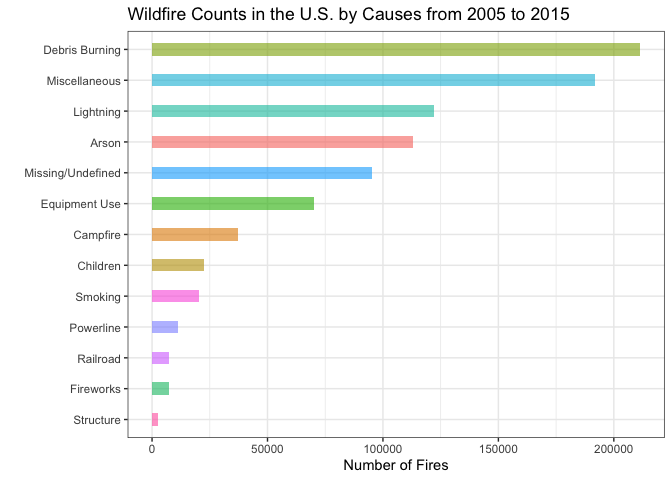
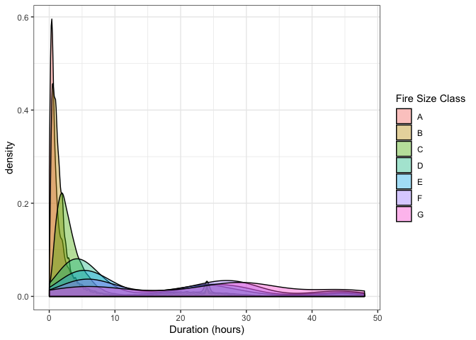
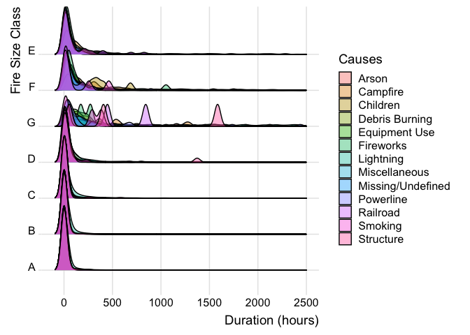

Exploratory Analysis
================
Jiarui Fu
12/1/2019

## R Markdown

``` r
fire = read_csv("./data/fire_0515.csv")
```

    ## Parsed with column specification:
    ## cols(
    ##   fire_year = col_double(),
    ##   discovery_date = col_double(),
    ##   discovery_time = col_character(),
    ##   stat_cause_descr = col_character(),
    ##   cont_date = col_double(),
    ##   cont_time = col_character(),
    ##   fire_size = col_double(),
    ##   fire_size_class = col_character(),
    ##   latitude = col_double(),
    ##   longitude = col_double(),
    ##   state = col_character(),
    ##   county = col_double(),
    ##   fips_code = col_character(),
    ##   fips_name = col_character()
    ## )

    ## Warning: 660575 parsing failures.
    ##   row    col expected actual                   file
    ## 72832 county a double Mohave './data/fire_0515.csv'
    ## 72833 county a double Mohave './data/fire_0515.csv'
    ## 72834 county a double Mohave './data/fire_0515.csv'
    ## 72835 county a double Mohave './data/fire_0515.csv'
    ## 72836 county a double Mohave './data/fire_0515.csv'
    ## ..... ...... ........ ...... ......................
    ## See problems(...) for more details.

``` r
tidy_fire = 
  fire %>% 
  separate(cont_time, into = c("cont_hour","cont_min") ,sep = 2) %>% 
  separate(discovery_time, into = c("disc_hour","disc_min") ,sep = 2) %>% 
  mutate(cont_hour = as.numeric(cont_hour),
         cont_min = as.numeric(cont_min),
         disc_hour = as.numeric(disc_hour),
         disc_min = as.numeric(disc_min))

state.abb = append(state.abb, c("DC", "PR"))
state.name = append(state.name, c("District of Columbia", "Puerto Rico"))

tidy_fire = 
  tidy_fire %>% 
  # change julian days
  mutate(discovery_date = as.Date(discovery_date - 2458014.5, origin = '2017-09-18'),
         cont_date = as.Date(cont_date - 2458014.5, origin = '2017-09-18'),
         duration_day = as.numeric(difftime(cont_date, discovery_date))
          ) %>% 
  mutate(
    duration_hour = cont_hour - disc_hour,
    duration_min = cont_min - disc_min,
    duration = duration_day / 60 + duration_hour * 60 + duration_min
  ) %>% 
  select(-duration_day, -duration_hour,-duration_min) %>% 
  mutate(fips_name = tolower(fips_name),
         state = fct_inorder(state),
         fire_size_class = fct_inorder(fire_size_class),
         region = state.name[match(state, state.abb)])

# cause ranking based on number of fires
tidy_fire %>% 
  group_by(stat_cause_descr) %>% 
  summarize(n_fire = n()) %>% 
  ggplot(aes(x = fct_reorder(stat_cause_descr, n_fire), y = n_fire)) +
  geom_bar(stat = "identity", aes(fill = stat_cause_descr), alpha=.6, width=.4) +
  coord_flip() +
  labs(x = "", y = "Number of Fires", title = "Wildfire Counts in the U.S. by Causes from 2005 to 2015") +
  viridis::scale_color_viridis() + theme_bw() + theme(legend.position = "none")
```

<!-- -->

``` r
# distribution of duration vs fire size class, set a maximum duration of 48hrs/2days
tidy_fire %>% 
  mutate(fire_size_class = fct_relevel(fire_size_class, c("A", "B", "C", "D", "E", "F", "G"))) %>% 
  drop_na(duration) %>% 
  filter(duration < 2880) %>%
  filter(duration != 0) %>%  
  ggplot(aes(x = duration/60, fill = fire_size_class)) +
  geom_density(alpha = 0.4) +
  labs(x = "Duration (hours)", fill = "Fire Size Class") +
  theme_bw()
```

<!-- -->

``` r
# wordclouding: causes by count
fire = 
  read_csv("data/fire_0515.csv") %>% 
  group_by(stat_cause_descr) %>% 
  summarise(n_cause = n())
```

    ## Parsed with column specification:
    ## cols(
    ##   fire_year = col_double(),
    ##   discovery_date = col_double(),
    ##   discovery_time = col_character(),
    ##   stat_cause_descr = col_character(),
    ##   cont_date = col_double(),
    ##   cont_time = col_character(),
    ##   fire_size = col_double(),
    ##   fire_size_class = col_character(),
    ##   latitude = col_double(),
    ##   longitude = col_double(),
    ##   state = col_character(),
    ##   county = col_double(),
    ##   fips_code = col_character(),
    ##   fips_name = col_character()
    ## )

    ## Warning: 660575 parsing failures.
    ##   row    col expected actual                 file
    ## 72832 county a double Mohave 'data/fire_0515.csv'
    ## 72833 county a double Mohave 'data/fire_0515.csv'
    ## 72834 county a double Mohave 'data/fire_0515.csv'
    ## 72835 county a double Mohave 'data/fire_0515.csv'
    ## 72836 county a double Mohave 'data/fire_0515.csv'
    ## ..... ...... ........ ...... ....................
    ## See problems(...) for more details.

``` r
set.seed(555)
p = wordcloud(words = fire$stat_cause_descr, freq = fire$n_cause, scale = c(3, .8), min.freq = 1,
          max.words=200, random.order=FALSE, rot.per=0.35, 
          colors=brewer.pal(8, "Dark2"))
```

<!-- -->
